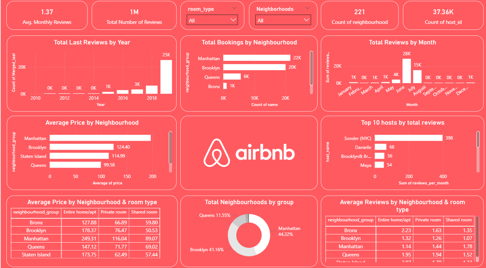
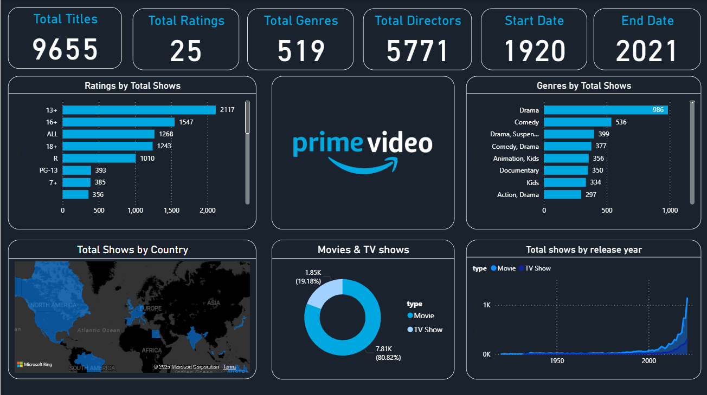

# 📊 Power BI Dashboards Portfolio  

This repository contains interactive dashboards created in **Power BI**. The dashboards use real-world datasets and showcase different analytical perspectives.  

---

## 🔹 Dashboards Included  

### 1. Prime Video Content Analysis  

**Objective:** Analyze the catalog of Prime Video shows and movies.  

**Key Insights:**  
- 📌 **Total Titles:** 9,655 across different genres and ratings.  
- 🎭 **Top Genres:** Drama and Comedy dominate the content.  
- 🌍 **Country Distribution:** Content spread across multiple countries, with the U.S. being the major contributor.  
- 🎥 **Movies vs. TV Shows:** 81% Movies, 19% TV Shows.  
- 📅 **Timeline:** Content spans from **1920 to 2021**, showing significant growth after 2000.  

---

### 2. Airbnb NYC Data Analysis  

**Objective:** Understand Airbnb listings, pricing, and reviews across New York City neighborhoods.  

**Key Insights:**  
- 🏘️ **Neighborhoods:** 221 neighborhoods across 5 boroughs.  
- 💲 **Pricing Trends:** Manhattan has the highest average price per listing.  
- 🛏️ **Room Type Distribution:** Majority are entire apartments/homes.  
- 🗓️ **Reviews Over Time:** Sharp increase in reviews post-2016.  
- 👤 **Top Hosts:** Sonder (NYC) is the most reviewed host.  

---

### Screenshots 

**Airbnb:**



**Amazon:**



---

## 🔹 How to View the Dashboards  

- Download the `.pbix` files from this repository and open in **Power BI Desktop**.  
- OR view screenshots included above for a quick overview.  

---

## 🔹 Skills Demonstrated  

- Data Cleaning & Transformation (**Power Query**)  
- Data Modeling (**Relationships, Measures, Calculated Columns**)  
- **DAX** (Data Analysis Expressions) for metrics  
- Interactive Visualizations (**Maps, KPIs, Drilldowns**)  
- **Dashboard Storytelling** for business insights  

---

## 🔹 Repository Structure  

```bash
📂 powerbi-dashboards
 ┣ 📁 dashboards
 ┃ ┣ prime_video.pbix
 ┃ ┣ airbnb_nyc.pbix
 ┣ 📁 images
 ┃ ┣ prime_video_dashboard.png
 ┃ ┣ airbnb_dashboard.png
 ┃ 📁 images
 ┃ ┣ prime_video_dashboard.png
 ┃ ┣ airbnb_dashboard.png
 ┣ README.md
```

 ---

✨ This repository is part of my Data Analytics Portfolio to showcase Power BI visualization and storytelling skills.
